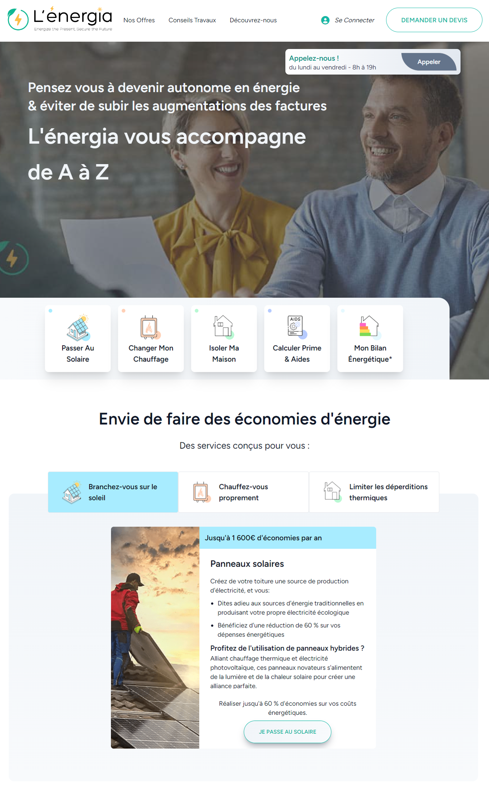
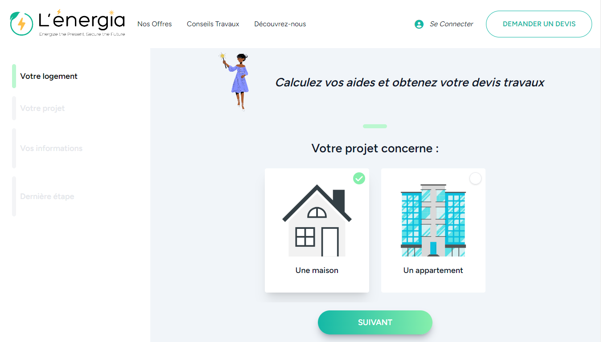
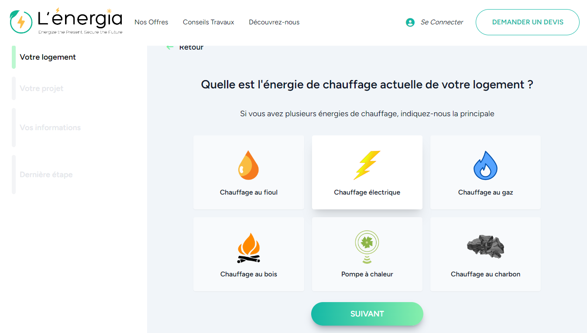
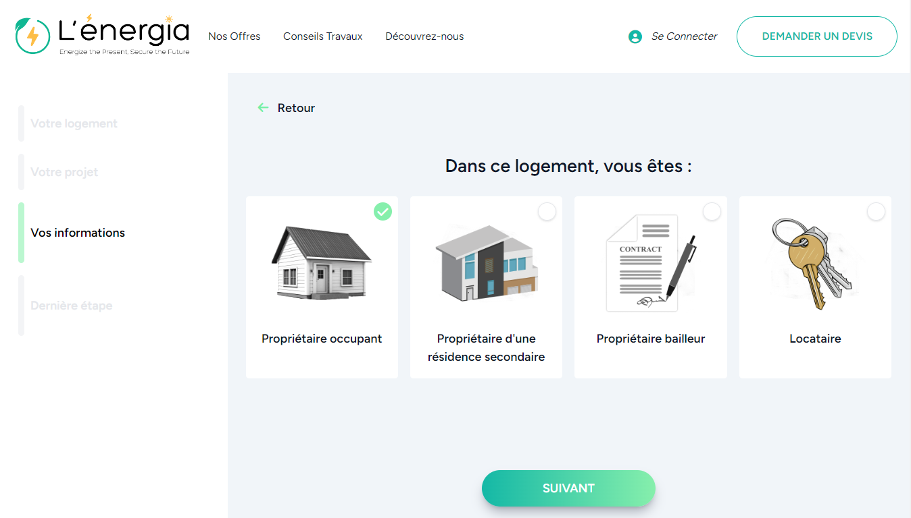
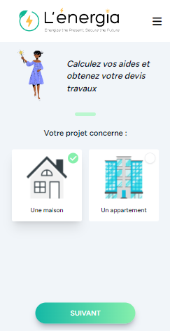
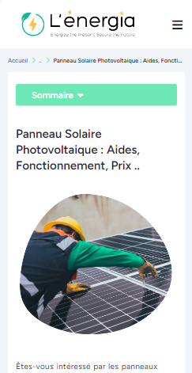
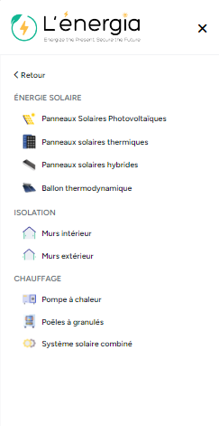

# 🌱 Lenergia – Energy & Renovation Services Platform

Lenergia is a commercial web platform designed to answer real call-center and lead-generation needs for the energy and home-renovation sector.

The platform allows users to browse energy and renovation services, follow a guided wizard to apply for a solution, and submit qualified requests that can later be handled by a commercial team.

---

## 🚀 Project Overview

Lenergia focuses on:

- high-conversion user experience
- step-by-step application wizard
- structured service catalog
- SEO-ready service pages
- centralized content management through database seeders

Typical user journey:

1. Select a service (solar, heating, insulation, etc.)
2. Complete a multi-step wizard
3. Submit a request
4. The request is stored in the system
5. A commercial agent contacts and follows up with the client

---

## ✨ Main Features

- Multi-service catalog (solar, heating, insulation, smart devices)
- Guided multi-step wizard
- Lead storage for call-center workflows
- SEO-optimized pages (slug, meta title, structured titles)
- Service icons and images (SVG, images, alt attributes)
- Fully seeder-driven content

---

## 🧩 Services Catalog

The platform uses a `works` table populated through a database seeder.

Services are grouped by category using the `type` field.

---

### ☀️ Solar & Renewable Energy (`type = es`)

- Panneaux solaires photovoltaïques  
- Panneaux solaires thermiques  
- Panneaux solaires hybrides  
- Ballon thermodynamique / chauffe-eau thermodynamique  

Some services reference public renovation and energy incentives such as  
**:contentReference[oaicite:0]{index=0}**.

---

### 🔥 Heating Systems (`type = ch`)

- Pompe à chaleur  
- Poêles à granulés  
- Système solaire combiné  

---

### 🧱 Insulation (`type = i`)

- Isolation des murs par l’intérieur  
- Isolation des murs par l’extérieur  

---

### 🌡 Smart & Control Devices (`type = t`)

- Thermostat connecté  

---

## 🧠 Data Model – `works` Table

Each service is defined inside a database seeder and contains the following fields:

| Field        | Description                                  |
|-------------|----------------------------------------------|
| `type`      | Service category (es, ch, i, t)               |
| `name`      | Display name                                 |
| `title`     | Main page title                               |
| `description` | Rich HTML content                         |
| `line_text` | Marketing call-to-action                     |
| `slug`      | SEO-friendly URL                             |
| `meta_title`| SEO meta title                               |
| `svg`       | Icon file                                    |
| `img`       | Main image                                   |
| `img_alt`   | Image alt text                               |

This structure allows:

- centralized service management
- consistent SEO output
- easy extension of the platform

---

## 🧭 Wizard & Lead Generation Flow

The wizard dynamically adapts to the selected service and collects:

- project information
- housing and installation context
- user contact details

The system then:

- validates the request
- stores it for later processing
- allows the commercial team to contact the client

This approach is optimized for call-center and sales teams.

---

## 📸 Screenshots

  
  







---

## 🛠 Installation (Local Development)

Clone the repository:

```bash
git clone https://github.com/issqTK/lenergia.git
cd lenergia